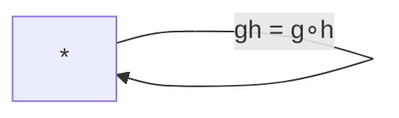
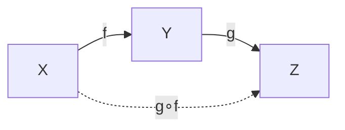
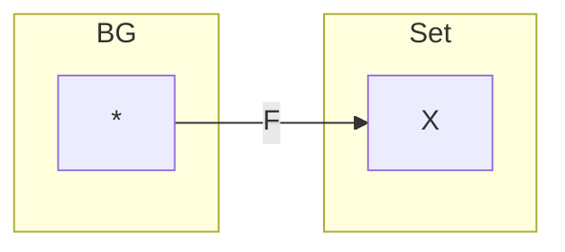
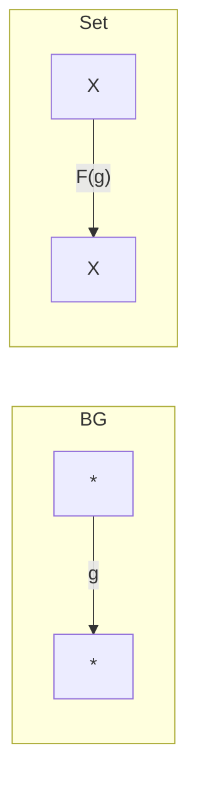
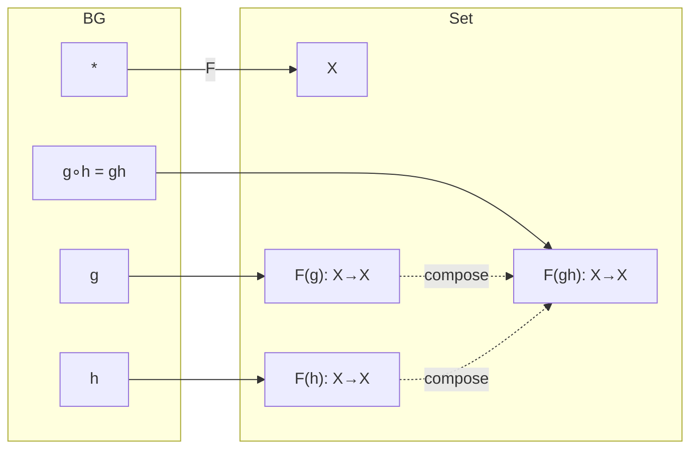

This is exactly the right question. The power of the functor definition comes from understanding **what the source category (C)** and **target category (D)** actually are.

Let's formalize it.

---

## General definition of a functor

A functor

$$
F:\mathcal C\to\mathcal D
$$

consists of:

1. an object map

$$
F:\operatorname{Ob}(\mathcal C)\to\operatorname{Ob}(\mathcal D)
$$

2. a morphism map

$$
F:\operatorname{Hom}*{\mathcal C}(A,B)
\to
\operatorname{Hom}*{\mathcal D}(F(A),F(B))
$$

such that

Identity is preserved:

$$
F(\mathrm{id}*A)=\mathrm{id}*{F(A)}
$$

Composition is preserved:

$$
F(g\circ f)
===========

F(g)\circ F(f)
$$

---

# For a group action

The source category is

$$
\mathcal C=BG
$$

The target category is

$$
\mathcal D=\mathbf{Set}
$$

Let's inspect each one carefully.

---

# Source category: (BG)

A group

$$
(G,\cdot,e)
$$

becomes a category.

## Objects

Exactly one.

$$
\operatorname{Ob}(BG)={\ast}
$$

Think:

> There is only one "state."

---

## Morphisms

Every group element is a morphism.

$$
\operatorname{Hom}(\ast,\ast)=G
$$

So

$$
g:\ast\to\ast
$$

for every

$$
g\in G.
$$

Example

If

$$
G=\mathbb Z_3
$$

then

$$
\operatorname{Mor}(BG)
======================

{0,1,2}
$$

under addition modulo 3.

---

## Composition law

Composition **is the group multiplication.**

If

$$
g,h\in G
$$

then

$$
g\circ h
========

gh
$$

(or (g+h) for additive notation).

Notice this is not a new operation.

The category literally reuses the group's multiplication.

---

Diagram

Everything loops back because there is only one object.

---

# Target category: Set

Now look at

$$
\mathcal D=\mathbf{Set}.
$$

## Objects

Every set.

Examples:

$$
\mathbb N,
\quad
\mathbb R,
\quad
X,
\quad
{a,b,c}
$$

So

$$
\operatorname{Ob}(\mathbf{Set})
===============================

{\text{all sets}}.
$$

---

## Morphisms

Functions.

If

$$
X,Y
$$

are sets,

then

$$
f:X\to Y
$$

is a morphism.

---

## Composition law

Exactly function composition.

If

$$
X\xrightarrow{f}Y\xrightarrow{g}Z
$$

then

$$
g\circ f:X\to Z.
$$

Diagram

---

# What the functor does

Now put them together.

Since (BG) has exactly one object,

the object map has only one choice:

$$
F(\ast)=X
$$

for some set (X).

Diagram

---

Every morphism

$$
g:\ast\to\ast
$$

becomes a function

$$
F(g):X\to X.
$$

Diagram

Notice:

Every group element becomes an endomorphism of (X).

---

# Why the group action law appears automatically

Functoriality requires

$$
F(g\circ h)
===========

F(g)\circ F(h).
$$

But

$$
g\circ h
========

gh
$$

inside (BG).

Therefore

$$
F(gh)
=====

F(g)\circ F(h).
$$

This is exactly the group action axiom.

If we write

$$
F(g)(x)=g\cdot x,
$$

then

$$
F(gh)(x)
========

# (F(g)\circ F(h))(x)

F(g)(F(h)(x)),
$$

which becomes

$$
(gh)\cdot x
===========

g\cdot(h\cdot x).
$$

So the familiar action law is nothing more than **preservation of composition by a functor**.

---

# Everything together

The key conceptual insight is that **nothing "acts" directly on elements in the categorical definition**. The group is first reinterpreted as a one-object category (BG), and a group action is then simply a functor from (BG) to (\mathbf{Set}). The entire algebraic structure of the action is recovered from the single requirement that a functor preserve identities and composition.
