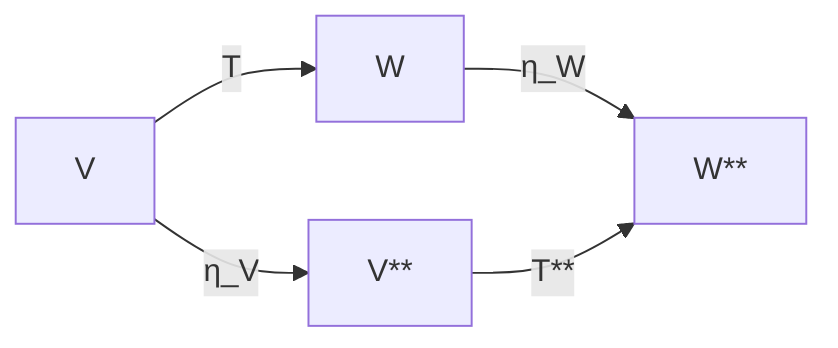

Yes. For a natural transformation, there are surprisingly **few axioms**. The complexity comes from the objects and functors involved, not from the definition itself.

Let's separate what you must **define** from what you must **prove**.

---

# Definition of a natural transformation

Suppose

$$
F,G:\mathcal C\to\mathcal D
$$

are functors.

To define

$$
\eta:F\Rightarrow G,
$$

you must provide:

### 1. One component for every object

For every object $A\in\mathcal C$,

define a morphism

$$
\eta_A:F(A)\to G(A).
$$

This is **data**, not something to prove.

For the double-dual example,

$$
\eta_V:V\to V^{**}
$$

defined by

$$
\eta_V(v)(\phi)=\phi(v).
$$

---

### 2. Each component must actually be a morphism

Since we're in the category of vector spaces,

every

$$
\eta_V
$$

must be linear.

So you prove

* additivity
* homogeneity

namely,

$$
\eta_V(v+w)=\eta_V(v)+\eta_V(w)
$$

and

$$
\eta_V(cv)=c\,\eta_V(v).
$$

This ensures

$$
\eta_V
$$

is a legitimate morphism.

---

# The only axiom to prove

Once the components are defined,

there is exactly one coherence law:

For every morphism

$$
T:V\to W,
$$

prove

commutes.

Equivalently,

$$
\boxed{
\eta_W\circ T=T^{**}\circ\eta_V.
}
$$

This is **the naturality axiom**.

---

# How is it proved?

Expand both sides.

Take

$$
v\in V,
\qquad
g\in W^*.
$$

Compute the left-hand side.

First,

$$
T(v)\in W.
$$

Then

$$
\eta_W(T(v))(g)=g(T(v)).
$$

Now compute the right-hand side.

First,

$$
\eta_V(v)
$$

is an element of

$$
V^{**}.
$$

Apply

$$
T^{**}.
$$

By definition,

$$
(T^{**}\eta_V(v))(g)=\eta_V(v)(T^*(g)).
$$

But

$$
T^*(g)=g\circ T.
$$

Therefore

$$
\eta_V(v)(T^*(g))=\eta_V(v)((g\circ T))=g(T(v)).
$$

Both sides reduce to

$$
g(T(v)).
$$

Hence

$$
\eta_W\circ T=T^{**}\circ\eta_V.
$$

---

# So the proof checklist is

For **any** proposed natural transformation:

### Step 1 — Specify the functors

Example

$$
F=\mathrm{Id},
\qquad
G=(-)^{**}.
$$

---

### Step 2 — Define the components

For every object,

construct

$$
\eta_A:F(A)\to G(A).
$$

---

### Step 3 — Show each component is a valid morphism

In **Vect**:

prove linearity.

In **Set**:

prove it's just a function.

In **Grp**:

prove it's a group homomorphism.

The category determines what "valid morphism" means.

---

### Step 4 — Prove naturality

For every morphism $f:A\to B$,

show

$$
\eta_B\circ F(f)=G(f)\circ\eta_A.
$$

This is the only coherence law.

---

# In the dual-space example

| Step                          | What you do                            |
| ----------------------------- | -------------------------------------- |
| Specify functors              | $\mathrm{Id}$, $(-)^{**}$              |
| Define components             | $\eta_V(v)(\phi)=\phi(v)$              |
| Show components are morphisms | Prove $\eta_V$ is linear               |
| Prove naturality              | Show $\eta_W\circ T=T^{**}\circ\eta_V$ |

---

## A useful pattern

For almost every natural transformation you encounter in mathematics or software engineering, the proof follows the same template:

1. **Construction:** Define the component $\eta_A$ uniformly for every object $A$.
2. **Well-definedness:** Verify each $\eta_A$ is a morphism in the category.
3. **Coherence (Naturality):** Verify the commuting-square equation for every morphism.

Everything else—evaluation maps, double duals, `Option` to `Vec`, `Future` to `Task`, etc.—is specific to the particular functors you're relating. The proof obligations themselves are always these three steps.
