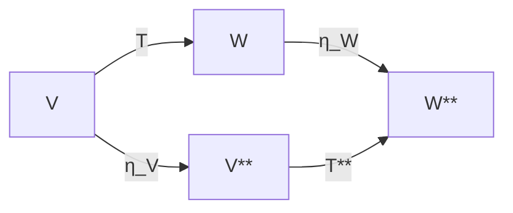

This is an excellent example because the **dual vector space** gives one of the canonical natural transformations in mathematics.

I'll build it from **first-order logic (FOL) → linear algebra → category theory → naturality**, enumerating every step.

---

# Goal

We want to understand why

$$
V \mapsto V^*
$$

(the dual-space construction)

is a functor, and why

$$
\eta_V : V \to V^{**}
$$

is a natural transformation.

---

# Level 0 — First-order logical vocabulary

Fix a field

$$
K.
$$

Our first-order language contains

## Sorts

* vectors
* scalars

---

## Function symbols

Vector addition

$$
+
:
V\times V\to V
$$

Scalar multiplication

$$
\cdot
:
K\times V\to V
$$

---

## Constants

Zero vector

$$
0
$$

---

## Equality

# $$

$$

---

# Step 1 — State the axioms

A vector space satisfies

Associativity

$$
\forall u,v,w
;
(u+v)+w=u+(v+w)
$$

Identity

$$
\forall v
;
v+0=v
$$

Inverse

$$
\forall v
;
\exists w
;
v+w=0
$$

Distributivity

$$
\forall a,b,v
;
(a+b)v=av+bv
$$

etc.

These are all first-order sentences.

---

# Step 2 — Introduce a concrete vector space

Take

$$
V=\mathbb R^2.
$$

Elements are

$$
\begin{pmatrix}
x\
y
\end{pmatrix}
$$

Example

$$
v=
\begin{pmatrix}
2\
5
\end{pmatrix}.
$$

---

# Step 3 — What is a dual vector?

The dual space

$$
V^*
$$

is

> the set of all linear maps

$$
f:V\to\mathbb R.
$$

Notice

elements are **functions**, not vectors.

---

Example

Define

$$
f(x,y)=3x+7y.
$$

Then

$$
f
\in
V^*.
$$

---

# Step 4 — Verify linearity

Need

$$
f(u+v)=f(u)+f(v)
$$

Take

$$
u=(1,2)
$$

and

$$
v=(4,5).
$$

Then

$$
u+v=(5,7).
$$

Compute

$$
f(5,7)
======

# 15+49

64.

$$

Now

$$
f(1,2)
======

17
$$

and

$$
f(4,5)
======

47.

$$

Indeed

$$
17+47=64.
$$

---

Also

$$
f(\lambda v)
============

\lambda f(v)
$$

holds.

Therefore

$$
f
\in
V^*.
$$

---

# Step 5 — Elements of the dual

Examples

$$
g(x,y)=x
$$

$$
h(x,y)=y
$$

$$
k(x,y)=2x-y
$$

Every linear functional belongs to

$$
V^*.
$$

---

# Step 6 — The dual itself is a vector space

Addition

$$
(f+g)(v)
========

f(v)+g(v).
$$

Scalar multiplication

$$
(cf)(v)
=======

cf(v).
$$

Thus

$$
V^*
$$

satisfies the vector-space axioms again.

---

# Step 7 — Introduce a linear map

Suppose

$$
T
:
V
\rightarrow
W.
$$

Example

$$
T(x,y)
======

(x+y,2x).
$$

---

# Step 8 — What happens to duals?

Suppose

$$
\phi
\in
W^*.
$$

Then

$$
\phi
:
W
\to
\mathbb R.
$$

Compose

$$
\phi\circ T.
$$

Result

$$
V
\rightarrow
\mathbb R.
$$

Therefore

$$
\phi\circ T
\in
V^*.
$$

---

This defines

$$
T^*
:
W^*
\to
V^*.
$$

Notice

direction reversed.

---

# Step 9 — Why reverse?

Suppose

```text
V ----T----> W
```

A functional lives on

```text
W
```

To evaluate something in

```text
V
```

we must first move

```text
V→W.
```

Hence

```text
W*

↓

V*
```

Direction reverses.

This makes the dual construction a **contravariant functor**.

---

# Step 10 — Double dual

Apply dual again.

$$
V^{**}
======

(V^*)^*.
$$

Now elements are

functions

$$
V^*
\rightarrow
\mathbb R.
$$

---

# Step 11 — Construct the canonical map

Take

$$
v\in V.
$$

Define

$$
\eta_V(v)
:
V^*
\to
\mathbb R
$$

by

$$
\eta_V(v)(f)
============

f(v).
$$

Read this carefully.

Input

is a functional

Output

is a scalar.

---

Example

Let

$$
v=(2,5)
$$

and

$$
f(x,y)=3x+7y.
$$

Then

$$
\eta_V(v)(f)
============

# f(2,5)

41.

$$

---

Notice

The vector

became

an evaluation functional.

---

# Step 12 — Why is this linear?

Take

$$
v+w.
$$

Then

$$
\eta(v+w)(f)
============

f(v+w)
$$

Linearity of

$f$

gives

# $$

f(v)+f(w)
$$

which equals

$$
\eta(v)(f)+\eta(w)(f).
$$

Thus

$$
\eta_V
:
V
\rightarrow
V^{**}
$$

is linear.

---

# Step 13 — Naturality

Suppose

$$
T
:
V
\rightarrow
W.
$$

There are now two paths.

First path

$$
V
\rightarrow
W
\rightarrow
W^{**}
$$

Second path

$$
V
\rightarrow
V^{**}
\rightarrow
W^{**}.
$$

---

The commuting square is



The claim is

$$
\eta_W\circ T
=============

T^{**}\circ\eta_V.
$$

---

# Step 14 — Verify with an element

Take

$$
v=(2,5).
$$

Take

$$
g
\in
W^*.
$$

### Left path

Move first

$$
Tv
$$

then evaluate

$$
g(Tv).
$$

---

### Right path

Turn

$v$

into an evaluation functional.

Then transport by

$$
T^{**}.
$$

Result

again

$$
g(Tv).
$$

The answers are identical.

---

# Step 15 — First-order logical statement

Naturality is itself an equational property that can be expressed as

$$
\forall v\in V,;
\forall g\in W^*,
;
(\eta_W(T(v)))(g)
=================

(T^{**}(\eta_V(v)))(g).
$$

Expanding the definitions,

* Left side:
  $$
  (\eta_W(T(v)))(g)=g(T(v)).
  $$

* Right side:
  $$
  (T^{**}(\eta_V(v)))(g)
  =\eta_V(v)(T^*(g))
  =(T^*(g))(v)
  =g(T(v)).
  $$

Both reduce to the same scalar (g(T(v))), proving the square commutes.

---

# Step 16 — What is actually happening?

The hierarchy of concepts is:

| Level | Mathematical object    | Example                               |
| ----- | ---------------------- | ------------------------------------- |
| 0     | Field                  | (\mathbb{R})                          |
| 1     | Vector space           | (V=\mathbb{R}^2)                      |
| 2     | Vector                 | (v=(2,5))                             |
| 3     | Linear functional      | (f(x,y)=3x+7y)                        |
| 4     | Dual space             | (V^*)                                 |
| 5     | Double dual            | (V^{**})                              |
| 6     | Canonical embedding    | (\eta_V:V\to V^{**})                  |
| 7     | Family of embeddings   | ({\eta_V}_V)                          |
| 8     | Natural transformation | (\eta:\mathrm{Id}\Rightarrow(-)^{**}) |

The key insight is that **naturality is not a statement about one vector or one vector space**. It is a statement about an entire **family** of maps (\eta_V), one for every vector space, that are coherent with every linear map (T). That coherence is precisely the commuting square, and it is what elevates the construction from an isolated isomorphism to a natural transformation.
