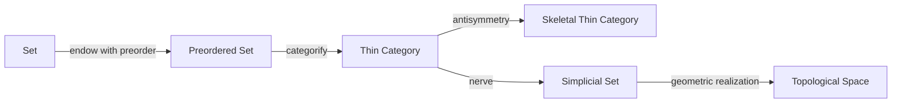

These are all connected by a common theme: **how much structure an object has and what kinds of paths you are allowed to follow**. Let's build the hierarchy from first principles.

---

# 1. Thin categories

## Definition

A category (\mathcal C) is **thin** if every hom-set has at most one morphism.

Formally,

$$
\forall A,B\in\mathrm{Ob}(\mathcal C),
\quad
|\mathrm{Hom}_{\mathcal C}(A,B)|\le1.
$$

Equivalently,

$$
f,g:A\to B
\implies
f=g.
$$

So between any two objects,

* zero arrows, or
* exactly one arrow.

Nothing else.

---

## Why preorders are thin

Given a preorder,

$$
(P,\le),
$$

define

$$
\operatorname{Hom}(x,y)=
\begin{cases}
{*},&x\le y\
\emptyset,&\text{otherwise}.
\end{cases}
$$

There is never a choice of arrows.

Either

$$
x\to y
$$

exists,

or it doesn't.

Hence

$$
|\operatorname{Hom}(x,y)|\le1.
$$

Therefore every preorder is a thin category.

---

# 2. Skeletal categories

Categories have a weaker notion than equality:

**isomorphism.**

Objects

$$
A,B
$$

are isomorphic if there exist

$$
f:A\to B,
\qquad
g:B\to A
$$

such that

$$
g\circ f=id_A,
$$

and

$$
f\circ g=id_B.
$$

---

A category is **skeletal** when

> Isomorphic objects are literally equal.

Formally,

$$
A\cong B
\Longrightarrow
A=B.
$$

So the only isomorphisms are identity morphisms.

---

## Why partial orders become skeletal

In a preorder,

suppose

$$
x\to y
$$

and

$$
y\to x.
$$

That means

$$
x\le y
\quad\text{and}\quad
y\le x.
$$

A preorder allows this.

A partial order adds antisymmetry:

$$
x\le y
\land
y\le x
\Longrightarrow
x=y.
$$

So

> antisymmetry

becomes

> every isomorphism is an identity.

Therefore

[
\boxed{
\text{partial orders}
=====================

\text{skeletal thin categories}.
}
]

---

# 3. Thin + skeletal

Putting them together

| Structure     | Category property |
| ------------- | ----------------- |
| preorder      | thin              |
| partial order | thin + skeletal   |

---

# 4. The nerve

The nerve is one of the most beautiful constructions in category theory.

It converts

$$
\text{Category}
\longrightarrow
\text{Simplicial Set}.
$$

The nerve remembers every composable chain.

---

## Definition

Given a category

$$
\mathcal C,
$$

the nerve

$$
N(\mathcal C)
$$

is defined by

$$
N_n(\mathcal C)
===============

{
A_0
\to
A_1
\to
\cdots
\to
A_n
}.
$$

That is,

the (n)-simplices are exactly the composable chains of length (n).

---

### 0-simplex

Objects.

$$
A
$$

---

### 1-simplex

Single arrows.

$$
A\to B
$$

---

### 2-simplex

Composable pairs.

$$
A\to B\to C
$$

Notice this already implies

$$
A\to C
$$

by composition.

So this chain is naturally represented by a filled triangle.

---

### 3-simplex

Chains

$$
A\to B\to C\to D
$$

become tetrahedra.

---

In general,

an (n)-simplex is simply

an increasing chain.

---

# Example

Suppose

$$
a\le b\le c.
$$

The nerve contains

0-simplices

$$
a,b,c
$$

1-simplices

$$
a\to b,
\qquad
b\to c,
\qquad
a\to c.
$$

2-simplex

$$
a\to b\to c.
$$

Geometrically,

that becomes a filled triangle.

---

# Why nerves matter

They convert

algebra

↓

geometry.

Instead of studying

relations,

you study

spaces.

This is the bridge into algebraic topology.

---

# 5. "Endowing" via a forgetful functor

Suppose

$$
U:\mathbf{Pos}\to\mathbf{Set}
$$

forgets the order.

It sends

$$
(X,\le)
\mapsto
X.
$$

The functor

forgets

* comparisons
* monotonicity
* lattice structure
* meets
* joins

and remembers only

the elements.

---

Thinking backwards,

"endowing"

means

> choosing extra structure so that applying (U) recovers the original object.

So

$$
X
\rightsquigarrow
(X,\le).
$$

Notice there is **not** generally a unique way to do this. The same underlying set can be endowed with many different partial orders. For example, on the set ({1,2,3}), you could choose the discrete order, the total order, or many others.

---

# 6. Is this a generalization of search?

This is a very insightful question.

The answer is:

> **Search algorithms operate on paths in a graph. A preorder gives a graph-like structure whose paths are composable morphisms.**

But there are important distinctions.

---

### Search on graphs

State space

$$
G=(V,E).
$$

Search explores

$$
v_0
\rightarrow
v_1
\rightarrow
\cdots.
$$

Multiple outgoing edges may exist.

Cycles may exist.

Many distinct paths may connect the same vertices.

---

### Search on a preorder

State space

$$
(P,\le).
$$

Move only upward:

$$
x\le y.
$$

Composition guarantees

$$
x\le y\le z
\Longrightarrow
x\le z.
$$

Since the category is thin, there is at most one morphism between comparable objects. Different **chains** may still exist—for example, (a\le b\le d) and (a\le c\le d)—but categorically they represent the same unique morphism (a\to d).

---

## Category-theoretic view of search

A search process can be modeled as a functor

$$
S:I\to\mathcal C,
$$

where

* (I) is an indexing category (often a finite chain, a tree, or another small category),
* (\mathcal C) is the state category.

For example,

$$
0\to1\to2\to3
$$

mapping into

$$
A\to B\to D\to E
$$

is a path.

The search itself is a functor.

---

# 7. A useful hierarchy

The progression looks like this:

From a search perspective:

* **Set**: states with no navigation.
* **Preordered set**: states plus a notion of reachability or refinement.
* **Thin category**: reachability becomes morphisms and composition.
* **Nerve**: every possible search chain becomes a simplex, encoding the combinatorics of all paths.
* **Topological space**: global properties of those search paths can be studied using topology (e.g., connectivity and higher-dimensional holes).

So the forgetful functor is not itself a search procedure. Rather, it describes **which structure is available to search over**. A search algorithm exploits the order (or more generally the morphisms of a category); the forgetful functor explains what information would be lost if you stripped that structure away and looked only at the underlying set.
