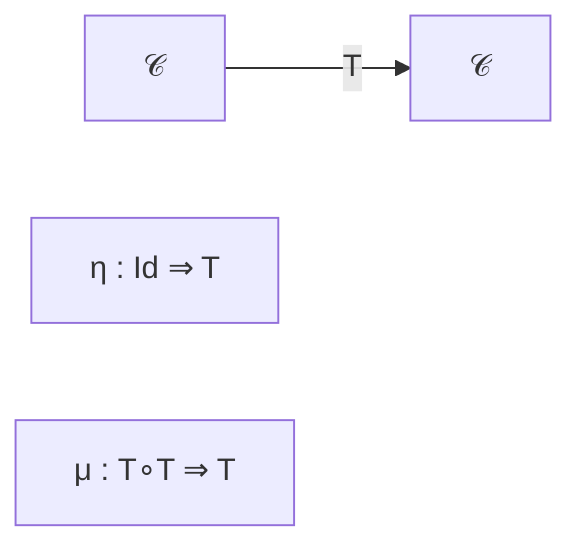
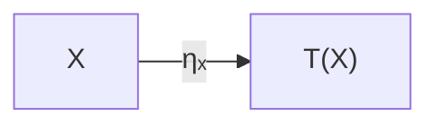
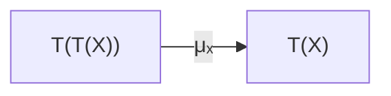
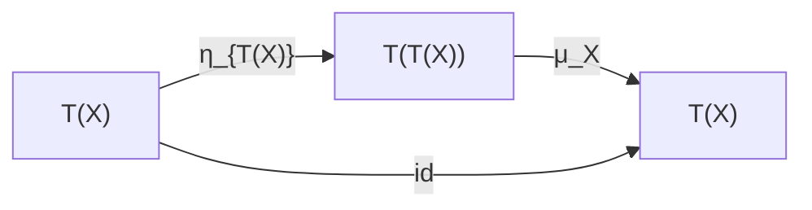
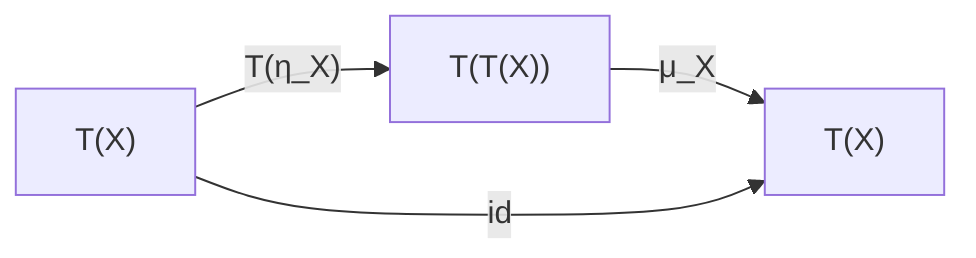
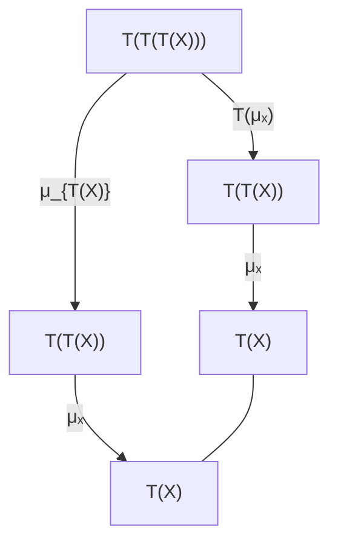
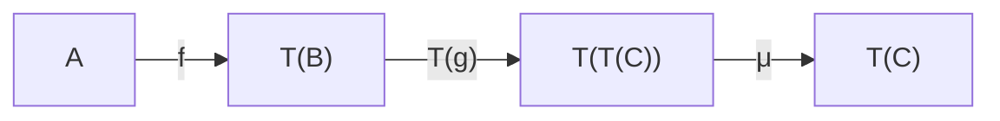

# Monad Diagrams

Here are the standard category-theoretic diagrams for a monad.

## 1. Monad data

A monad consists of an endofunctor and two natural transformations:

Equivalently,

$$T:\mathcal C\to\mathcal C$$

$$\eta:\mathrm{Id}_{\mathcal C}\Rightarrow T$$

$$\mu:T^2\Rightarrow T.$$

---

## 2. Unit (η)

For every object $X$,

$$\eta_X:X\rightarrow T(X).$$

---

## 3. Multiplication (μ)

$$\mu_X:T(T(X))\rightarrow T(X).$$

---

## 4. Left identity law

The following diagram commutes.

meaning

$$\mu_X\circ\eta_{T(X)}=\operatorname{id}_{T(X)}.$$

---

## 5. Right identity law

meaning

$$\mu_X\circ T(\eta_X)=\operatorname{id}_{T(X)}.$$

---

## 6. Associativity

This is the key coherence condition.

which states

$$\mu_X\circ T(\mu_X)=\mu_X\circ\mu_{T(X)}.$$

---

## 7. Kleisli composition

Given

$$f:A\to T(B),\qquad g:B\to T(C),$$

their composition is

or algebraically,

$$g\star f=\mu_C\circ T(g)\circ f.$$

This diagram shows why a monad provides a notion of composition for **effectful morphisms**: $T(g)$ lifts the second computation into the effectful context, and $\mu$ collapses the resulting nested effect back into a single layer.