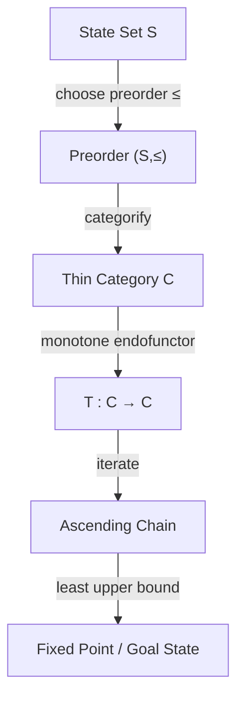

I think there is a very fruitful way to organize algorithms, but I'd sharpen one point first:

> **Not every algorithm is fundamentally a search on a preorder.**

Rather, many algorithms can be decomposed into

1. a **state category**,
2. a **notion of progress** (often a preorder),
3. **monotone transition operators**,
4. a **goal predicate** or **fixed point**.

This is broader and, I think, mathematically cleaner.

---

# General Framework

Every search algorithm can often be modeled as a tuple

$$
(P,\le,T,G)
$$

where

* (P) = state space
* (\le) = preorder describing progress
* (T:P\to P) or (T:P\to\mathcal P(P)) = transition operator
* (G\subseteq P) = goal states

Categorically,

construct the thin category

$$
\mathcal P
$$

whose

Objects

$$
Ob(\mathcal P)=P
$$

Morphisms

$$
x\to y
\iff
x\le y.
$$

The transition operator becomes an endofunctor or monotone map

$$
T:\mathcal P\to\mathcal P.
$$

---

# Example 1 — Binary Search

## Problem

Find

```
37
```

inside

```
[3,7,11,19,22,37,51]
```

---

## State Space

Intervals

$$
P=
{
[l,r]
\mid
0\le l\le r<n
}.
$$

---

## Order

Reverse inclusion

$$
[l_1,r_1]
\le
[l_2,r_2]
\iff
[l_1,r_1]
\supseteq
[l_2,r_2].
$$

This means

larger interval

↓

smaller interval

is progress.

---

## Category

Objects

all intervals.

Morphisms

$$
I\to J
\iff
I\supseteq J.
$$

Thin?

Yes.

Skeletal?

Yes.

Therefore

a poset category.

---

## Transition

```
mid=(l+r)/2

if target<a[mid]:
    [l,r]→[l,mid-1]

else:

    [l,r]→[mid+1,r]
```

Formally

$$
T(I)\subseteq I.
$$

Hence

$$
T(I)\le I.
$$

Strict progress.

---

## Monotonicity

Suppose

$$
I_1\supseteq I_2.
$$

Then

binary search satisfies

$$
T(I_1)\supseteq T(I_2).
$$

Therefore

$$
I_1\le I_2
\implies
T(I_1)\le T(I_2).
$$

So

(T)

is monotone.

---

Termination follows because interval length

$$
|I|
$$

strictly decreases.

---

# Example 2 — BFS

State

vertices

$$
V.
$$

Order

reachability

$$
u\le v
\iff
u
\rightsquigarrow
v.
$$

Category

objects

vertices.

Morphisms

paths.

Notice

this is **not thin** unless you quotient by reachability, because there may be many distinct paths between two vertices. More naturally, one uses the **free category** on the graph, whose morphisms are all finite paths.

---

Transition

Neighborhood operator

$$
N(v)
====

{w
\mid
(v,w)\in E
}.
$$

The frontier evolves by

$$
F_{k+1}
=======

N(F_k).
$$

---

Monotonicity

Reachable set

$$
R_k
$$

satisfies

$$
R_k
\subseteq
R_{k+1}.
$$

The transition

is monotone

on

$$
(\mathcal P(V),\subseteq).
$$

Notice

the search actually happens

on the Boolean lattice

not directly on

the graph.

This is an important insight.

---

# Example 3 — Bitmask DP

Carrier

$$
P
=

\mathcal P(S).
$$

Order

subset

$$
A
\subseteq
B.
$$

Category

Boolean lattice.

Transition

```
dp[S]

↓

dp[S∪{x}]
```

Monotone because

$$
A
\subseteq
B
\implies
A\cup{x}
\subseteq
B\cup{x}.
$$

---

Example

Traveling Salesman

```
0001

↓

0011

↓

0111

↓

1111
```

Every step

adds information.

---

# Example 4 — Topological Sort

State

already-completed vertices.

Carrier

$$
\mathcal P(V).
$$

Order

subset.

Transition

add one zero-indegree vertex.

```
Done

↓

Done∪{v}
```

Monotone.

---

# Example 5 — Dataflow Analysis

This is where monotone bounded maps become central.

---

Carrier

Possible variable information.

Suppose

```
Unknown

↓

Positive

↓

Constant(5)
```

---

Order

Information refinement

$$
Unknown
\le
Positive
\le
Constant(5).
$$

---

Transfer function

```
x=x+1
```

induces

$$
F:
L
\to
L.
$$

Example

```
Unknown

↓

Unknown
```

```
Positive

↓

Positive
```

```
Constant(5)

↓

Constant(6)
```

Monotone because

more information

never becomes

less information.

---

Knaster–Tarski

If

$$
L
$$

is a complete lattice

and

$$
F:L\to L
$$

is monotone,

then

there exists

a least fixed point

$$
F(x)=x.
$$

The analysis repeatedly computes

$$
\bot
\le
F(\bot)
\le
F^2(\bot)
\le
\cdots
$$

until stabilization.

This is exactly how many compiler analyses work.

---

# The category-theoretic picture

The hierarchy is



---

# From code to category

Suppose you write

```rust
while !goal(state) {
    state = transition(state);
}
```

This has a precise categorical interpretation:

| Code           | Mathematics        | Category Theory                        |
| -------------- | ------------------ | -------------------------------------- |
| `state`        | (x\in P)           | object                                 |
| `transition`   | (T:P\to P)         | endofunctor (or monotone endomorphism) |
| `state ≤ next` | preorder           | morphism                               |
| `while`        | iteration (T^n)    | repeated composition                   |
| `goal`         | terminal predicate | terminal object or fixed point         |
| termination    | well-founded order | no infinite descending chains          |

---

# A Category-Theoretic Taxonomy

I would go one step further than the preorder classification and organize algorithms by the category of their state spaces:

| State category            | Underlying order/structure | Canonical algorithms                       | Monotone operator    |
| ------------------------- | -------------------------- | ------------------------------------------ | -------------------- |
| Total orders              | Linear order               | Binary search, merge                       | Interval shrinking   |
| Boolean lattices          | Subset inclusion           | Bitmask DP, subset DP                      | Add an element       |
| Complete lattices         | Information refinement     | Dataflow analysis, abstract interpretation | Transfer function    |
| Free categories on graphs | Paths as morphisms         | DFS, BFS, shortest path (unweighted)       | Path extension       |
| DAG categories            | Reachability               | Topological sort, DAG DP                   | Extend completed set |
| Product posets            | Coordinatewise order       | Multi-objective optimization               | Dominance extension  |

The recurring theorem is that if:

1. your state space has a **well-founded preorder** (or stronger, a complete lattice when fixed points are needed), and
2. your transition operator is **monotone**,

then you obtain powerful guarantees about correctness, convergence, or termination. This is why order theory and category theory show up in compiler optimization, model checking, abstract interpretation, and fixed-point algorithms: the correctness proofs are often proofs about monotone maps on ordered categories rather than about the code directly.
