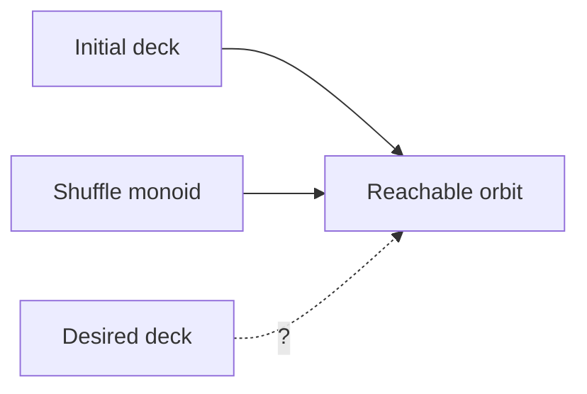
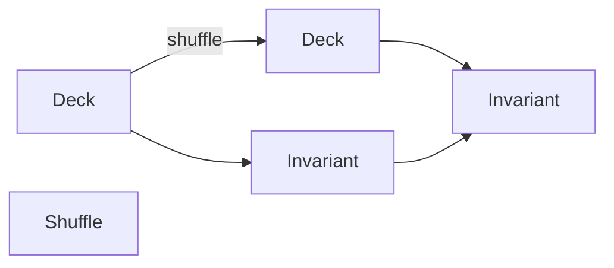

You're very close, but there is one point I'd be careful about before committing to this proof.

The **invariant principle** you're looking for is a statement about **the orbit of the monoid action**. However, **parity (the sign homomorphism)** is only the correct invariant if every generator lies in the same coset of (A_{52}). You first need to compute the parity of the in-shuffle and out-shuffle permutations. If one is even and the other is odd, then the sign is **not** preserved by the generated monoid (indeed the generated group contains both parities), so parity cannot be the invariant.

So let's formalize the problem independently of which invariant ultimately works.

---

# 1. State space

Let

* (P={1,\dots,52}) be positions,
* (C=S\times R) be card identities.

A deck is

[
d:P\overset{\cong}{\longrightarrow}C.
]

Hence the state space is

[
D=\operatorname{Bij}(P,C).
]

---

# 2. Shuffle monoid

Let

[
M=\langle i,o\rangle
]

where

[
i,o\in\operatorname{Aut}(P)\subseteq\operatorname{End}(P).
]

Composition is the monoid operation.

---

# 3. Action

The action is

[
\alpha:M\times D\to D
]

defined by

[
\alpha(m,d)=d\circ m^{-1}.
]

Every shuffle sequence is simply one element of (M).

---

# 4. Orbit

The reachable decks are

[
\operatorname{Orb}(d_0)
=======================

{m\cdot d_0:m\in M}.
]

This is the semigroup-theoretic notion of reachability.



The invariant principle says

> find a function constant on every orbit.

---

# 5. General invariant

Formally, an invariant is a map

[
I:D\to X
]

such that

[
I(m\cdot d)=I(d)
]

for every

[
m\in M.
]

Then

```text
Initial deck
      │
      ▼
Invariant value = x

Every shuffle

      │

Invariant value = x

Goal deck

must also have

Invariant value = x
```

If the goal has a different invariant value, it is unreachable.

---

# 6. Category-theoretically

The invariant is exactly an (M)-equivariant map into the trivial (M)-set.

If (X) has the trivial action

[
m\cdot x=x,
]

then

[
I:D\to X
]

must satisfy

[
I\circ\alpha
============

I.
]

Equivalently,



The lower arrow is the identity because the invariant never changes.

---

# 7. Where parity fits

Suppose both generators satisfy

[
\operatorname{sgn}(i)=1,
\qquad
\operatorname{sgn}(o)=1.
]

Then every word satisfies

[
\operatorname{sgn}(m)=1.
]

Indeed,

[
\operatorname{sgn}:S_{52}\to{\pm1}
]

is a group homomorphism,

[
\operatorname{sgn}(fg)
======================

\operatorname{sgn}(f)
\operatorname{sgn}(g).
]

Thus

[
M\subseteq A_{52}.
]

Then parity is an invariant.

However, this depends entirely on the parities of the generators. You should verify those first.

---

# 8. If parity works

The proof becomes

[
M
\xrightarrow{\operatorname{sgn}}
{\pm1}.
]

Since

[
\operatorname{sgn}(m)=1
]

for every shuffle,

the orbit of the initial deck lies entirely inside

[
A_{52}\cdot d_0.
]

If every permutation taking the initial deck to the desired deck has sign (-1), then the goal deck belongs to the other coset,

[
(S_{52}\setminus A_{52})\cdot d_0,
]

so it cannot lie in the same orbit.

---

## One thing I would check before proceeding

The statement

> "the two black suits in the middle require exactly (or at least) 13 transpositions"

is not immediate. The **sign of a permutation is well-defined**, but the **number of transpositions used in a particular decomposition is not**. What *is* invariant is the parity (even vs. odd) of the number of transpositions in any decomposition.

So the correct route is not to argue "it needs 13 swaps," but to compute the sign of the unique permutation that sends the initial arrangement to the target arrangement (or equivalently count its inversions modulo 2). That gives a rigorous parity invariant—provided the shuffle generators preserve parity. The first thing I'd verify is therefore the parity of the in-shuffle and out-shuffle themselves. If one of them is odd, you'll need a different invariant.
