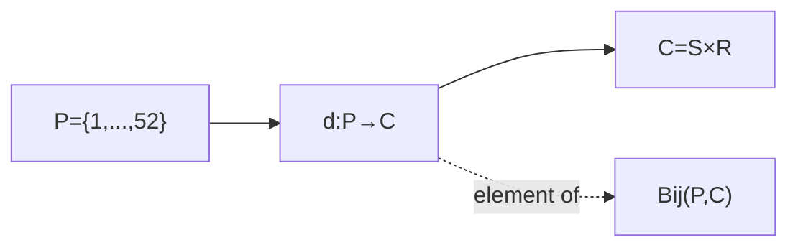
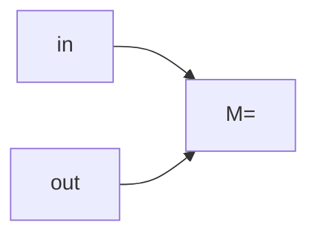
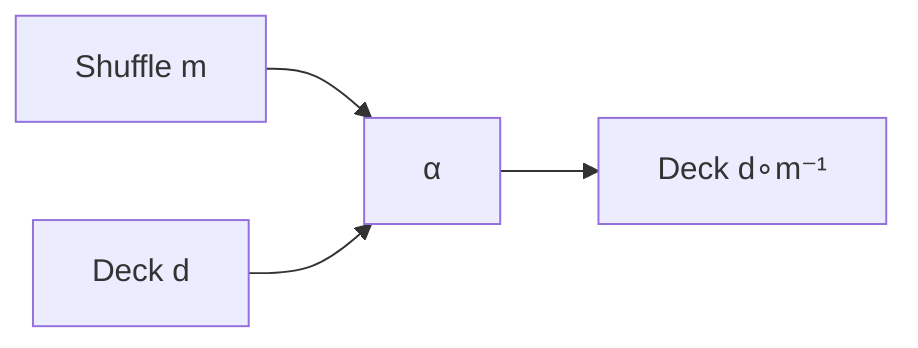
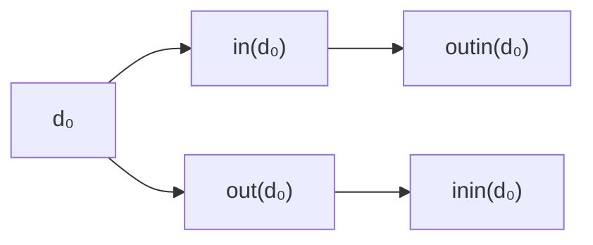
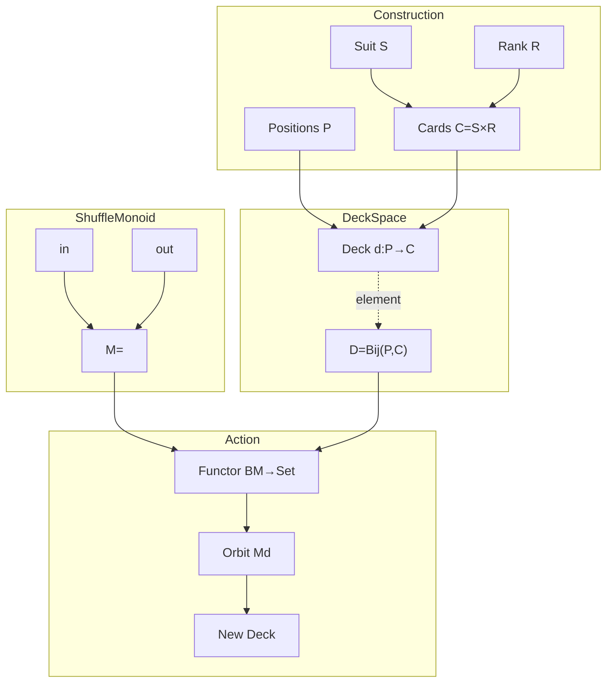

This is exactly the right set of questions. The subtlety is that you're moving between **three different categories**:

1. **Set** (where the cards and positions live),
2. **Mon** (where the shuffle monoid lives),
3. **Act(M)** (the category of sets equipped with an (M)-action, where the deck space naturally lives).

Keeping these separate makes everything fit together cleanly.

---

# Level 0 — The underlying sets

We first construct four sets.

$$
S={\spadesuit,\heartsuit,\diamondsuit,\clubsuit}
$$

$$
R={A,\ldots,K}
$$

$$
C=S\times R
$$

$$
P={1,\ldots,52}.
$$

Here

* (S,R,C,P) are **objects of (\mathbf{Set})**.

Notice

* (P) carries a natural total order

$$
1<2<\cdots<52.
$$

That order is **extra structure**. A shuffle generally does **not** preserve this order, so the shuffle is **not** an order morphism in **Poset**. It is only a bijection in **Set**.

---

# Level 1 — The deck space

A deck is

$$
d:P\to C.
$$

Not every function.

Only bijections.

Therefore

$$
D=\operatorname{Bij}(P,C).
$$

is itself another set.

So



The important point is

> (d) is an **element** of (D).

Not an object.

The object is

$$
D=\operatorname{Bij}(P,C).
$$

---

# Level 2 — The shuffle monoid

Now independently build



Generators

$$
\Sigma={\text{in},\text{out}}
$$

generate

$$
M=\langle\text{in},\text{out}\rangle.
$$

Composition is

$$
m_2\circ m_1.
$$

Identity

$$
e.
$$

So (M) is an object in **Mon**.

---

# Level 3 — Evaluation

Every

$$
m\in M
$$

acts on decks.

The action

$$
\alpha:M\times D\to D
$$

is

$$
\alpha(m,d)=d\circ m^{-1}.
$$

Diagram



The output is another element

of

$$
D=\operatorname{Bij}(P,C).
$$

---

# Orbit

You observed something important.

Starting from one deck

$$
d_0
$$

consider

$$
Md_0
====

{
m\cdot d_0
:
m\in M
}.
$$

This is exactly the **orbit**.



Because the deck space is finite,

every orbit is finite.

If (M) is actually a group (as with perfect in- and out-shuffles), repeatedly applying a shuffle eventually returns to the original deck, producing a cycle. If you allow non-invertible operations, then a finite monoid action need not consist solely of cycles; more general finite directed graphs can occur.

---

# Which things are objects?

This depends on the category.

## In Set

Objects

$$
S,R,C,P,D
$$

Morphisms

functions

for example

$$
d:P\to C.
$$

Composition

ordinary function composition.

---

## In Mon

Objects

monoids

for example

$$
M.
$$

Morphisms

monoid homomorphisms.

---

## In Act(M)

Objects

pairs

$$
(X,\alpha)
$$

where

$$
\alpha:M\times X\to X.
$$

Our object is

$$
(D,\alpha).
$$

Morphisms satisfy

$$
f(mx)=mf(x).
$$

These are equivariant maps.

---

# Is d a functor?

No.

This is one of the biggest distinctions.

A functor maps

* objects to objects
* morphisms to morphisms.

But

$$
d:P\to C
$$

is simply a morphism in **Set**.

It is **not** a functor.

---

# Where do functors appear?

There are two beautiful ones.

---

## 1. Forgetful functor

$$
U:\mathbf{Act}(M)\to\mathbf{Set}.
$$

It forgets the action.

```text
(M-action)

↓

Underlying set
```

---

## 2. Action functor

A monoid

can be regarded as

a one-object category.

Call it

$$
BM.
$$

There is one object

$$
*
$$

and

$$
\mathrm{Hom}(*,*)=M.
$$

Then an action is exactly a functor

$$
F:BM\to\mathbf{Set}.
$$

This is one of the nicest categorical facts.

It sends

the unique object

to

$$
D.
$$

It sends

every shuffle

to

a function

$$
D\to D.
$$

Specifically,

$$
F(m)(d)=d\circ m^{-1}.
$$

---

# The complete categorical picture



## Summary of the structures

| Mathematical object     | Lives in                 | Role                             |
| ----------------------- | ------------------------ | -------------------------------- |
| $S,R,P,C,D$             | $\mathbf{Set}$           | Objects (sets)                   |
| $d:P\to C$              | $\mathbf{Set}$           | Morphism (a bijection)           |
| $d\in D$                | Set-theoretic membership | A deck state                     |
| $M$                     | $\mathbf{Mon}$           | Shuffle monoid                   |
| $\alpha:M\times D\to D$ | $\mathbf{Act}(M)$        | Monoid action                    |
| $BM$                    | One-object category      | Categorification of the monoid   |
| $F:BM\to\mathbf{Set}$   | Functor category         | Encodes the action categorically |

The key conceptual step is that the monoid itself does **not** act directly on the set of cards ($C$); it acts on the **space of bijections** ($D=\operatorname{Bij}(P,C)$). That action can be viewed either algebraically as $\alpha:M\times D\to D$ or categorically as a functor $F:BM\to\mathbf{Set}$, where the unique object of $BM$ is sent to the deck space $D$ and each shuffle word is sent to the corresponding endomorphism $D\to D$.
