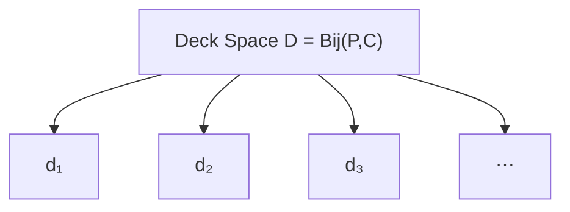
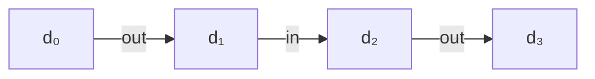
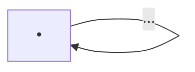
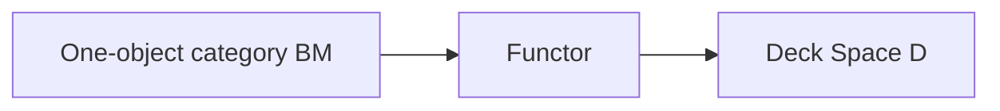
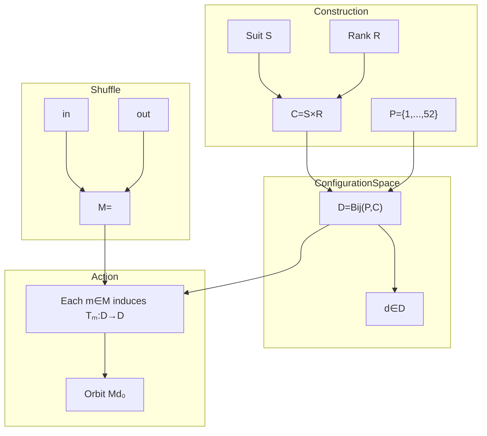

I think the missing conceptual step is this:

> **The monoid does not act on one deck. It acts on the entire configuration space of all decks.**

This is exactly analogous to how a permutation group acts on a set of points.

---

# Step 1. Build the configuration space

You have already built

$$
P={1,\ldots,52}
$$

and

$$
C=S\times R.
$$

Now define

$$
\boxed{D=\operatorname{Bij}(P,C).}
$$

This has a standard name:

* **configuration space**
* **state space**
* **deck space**
* **torsor of bijections** (in a more geometric/algebraic viewpoint)

The first three names are the ones you'll see most often.

It is simply the set

$$
D=
{
d:P\to C
\mid
d\text{ is bijective}
}.
$$

Notice

$$
d\in D.
$$

Every individual deck is one point inside this state space.

---

# Step 2. Visualize the deck space

Think of (D) as a huge cloud.



Each node

is one complete ordering of 52 cards.

There are

$$
|D|=52!
$$

points.

---

# Step 3. Where does the monoid act?

The monoid

does **not**

act on

$$
P
$$

or

$$
C.
$$

Instead it induces functions

$$
D\to D.
$$

For every

$$
m\in M
$$

define

$$
T_m:D\to D
$$

by

$$
T_m(d)
=
d\circ m^{-1}.
$$

Notice the types.

First

$$
m^{-1}:P\to P
$$

then

$$
d:P\to C.
$$

Composition gives

$$
P
\xrightarrow{m^{-1}}
P
\xrightarrow{d}
C.
$$

Therefore

$$
T_m(d)
\in
D.
$$

---

# Step 4. This is the action

The action is


Formally

$$
\boxed{
\alpha:M\times D\to D.
}
$$

Every shuffle is simply

a function

$$
D\to D.
$$

---

# Step 5. One shuffle

Suppose

```text
d₀

1→A♠
2→2♠
3→3♠
...
```

Apply

OutShuffle.

It becomes

```text
d₁

1→A♠
2→A♥
3→2♠
...
```

Nothing magical happened.

We simply moved from

one point

of (D)

to another point.

---

# Step 6. Therefore every monoid element is a graph edge

Imagine



This graph

lives inside

the state space

(D).

---

# Step 7. Constructing the orbit

Pick

one deck

$$
d_0\in D.
$$

Now apply every possible shuffle word.

Identity

$$
e(d_0)=d_0.
$$

Generators

$$
\operatorname{in}(d_0),
$$

$$
\operatorname{out}(d_0).
$$

Length two

$$
\operatorname{inin}(d_0),
$$

$$
\operatorname{outin}(d_0),
$$

$$
\operatorname{inout}(d_0),
$$

etc.

Collect them.

That set is

$$
\boxed{
Md_0
=

{
m(d_0)
:
m\in M
}.
}
$$

Explicitly,

$$
Md_0
=

{
d_0,
\operatorname{in}(d_0),
\operatorname{out}(d_0),
\operatorname{inin}(d_0),
\operatorname{inout}(d_0),
\operatorname{outin}(d_0),
\ldots
}.
$$

This is exactly the orbit.

---

# Step 8. The action functor

This is where category theory becomes elegant.

Your monoid is also

a one-object category



Every morphism

is a shuffle word.

Now define a functor

$$
F:BM\to\mathbf{Set}.
$$

The functor sends

the unique object

to

$$
D.
$$

Every morphism

$$
m
$$

becomes

the function

$$
T_m:D\to D.
$$

So



---

# The complete construction



## The unifying perspective

The whole construction is an instance of a general pattern in category theory and dynamical systems:

1. **Build a configuration space** (D) (all legal states).
2. **Build an algebra of transformations** (M) (all legal operations).
3. **Represent each operation as an endomorphism** of the configuration space:
   $$
   \rho : M \longrightarrow \operatorname{End}(D), \qquad
   \rho(m)=T_m.
   $$
   Here (\operatorname{End}(D)) is the monoid of all functions (D\to D) under composition.
4. The orbit of a state (d_0\in D) is then
   $$
   Md_0={\rho(m)(d_0)\mid m\in M}\subseteq D.
   $$

This representation (\rho) is the precise bridge between the abstract shuffle monoid and the concrete deck space: it realizes the generators `in` and `out` as actual transformations of deck configurations, and the orbit is simply the image of one initial deck under every transformation in that representation.
