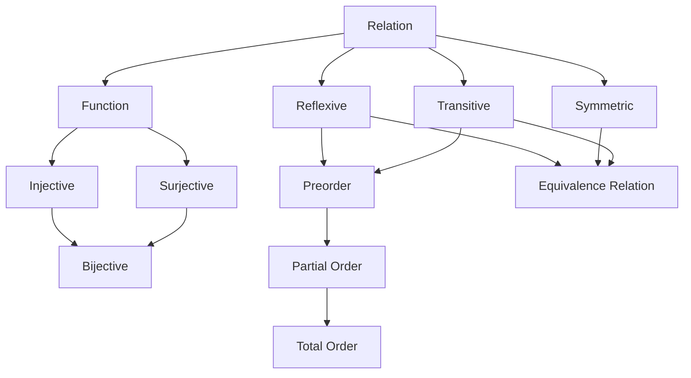

Your intent is a **taxonomy of important relation classes**. A useful way to organize them is by progressively adding axioms. Most structures used in mathematics and computer science are just relations satisfying particular combinations of properties.

| Structure           | Formalization          | Additional axioms                     | Typical applications                            |
| ------------------- | ---------------------- | ------------------------------------- | ----------------------------------------------- |
| Arbitrary relation  | (R\subseteq A\times B) | none                                  | Graphs, databases, knowledge graphs             |
| Partial relation    | (R\subseteq A\times B) | not necessarily total                 | Partial functions, optional lookups             |
| Total relation      | (R\subseteq A\times B) | every (a) relates to at least one (b) | Transition systems, nondeterministic automata   |
| Functional relation | relation               | at most one output per input          | Deterministic systems                           |
| Function            | relation               | total + functional                    | Programming, mathematical functions             |
| Injective function  | function               | distinct inputs remain distinct       | IDs, embeddings, reversible encoding            |
| Surjective function | function               | every output is reached               | Quotients, projections, APIs covering all cases |
| Bijection           | function               | injective + surjective                | Renaming, permutations, isomorphisms            |

---

# Binary relations on one set

These classify the "shape" of a graph on one set.

| Structure     | Properties               | Applications                  |
| ------------- | ------------------------ | ----------------------------- |
| Reflexive     | (aRa)                    | Reachability, type systems    |
| Irreflexive   | never (aRa)              | Strict precedence             |
| Symmetric     | (aRb\Rightarrow bRa)     | Friendship, undirected graphs |
| Antisymmetric | (aRb,bRa\Rightarrow a=b) | Hierarchies                   |
| Asymmetric    | (aRb\Rightarrow\neg bRa) | Dependencies                  |
| Transitive    | (aRb,bRc\Rightarrow aRc) | Reachability, implication     |

---

# Common combinations

These are arguably the most important relation classes.

| Structure             | Axioms                                     | Examples                                   |
| --------------------- | ------------------------------------------ | ------------------------------------------ |
| Preorder              | reflexive + transitive                     | Reachability, refinement, subtype relation |
| Partial order (poset) | preorder + antisymmetric                   | Dependency graphs, subset inclusion        |
| Total (linear) order  | partial order + comparability              | Numbers, sorting                           |
| Strict partial order  | transitive + irreflexive                   | Happens-before, scheduling                 |
| Strict total order    | strict partial order + total comparability | Lexicographic order                        |
| Equivalence relation  | reflexive + symmetric + transitive         | Equality modulo (n), connected components  |
| Tolerance relation    | reflexive + symmetric                      | Similarity relations                       |
| Apartness relation    | irreflexive + symmetric                    | Constructive mathematics                   |

---

# Graph-theoretic interpretations

Every binary relation is a directed graph.

| Relation property | Graph interpretation                  |
| ----------------- | ------------------------------------- |
| Reflexive         | self-loops                            |
| Symmetric         | undirected edges                      |
| Antisymmetric     | no two-way edges except loops         |
| Transitive        | every path of length 2 has a shortcut |
| Irreflexive       | no self-loops                         |
| Asymmetric        | DAG-like local behavior               |

Some important graph-derived relations include:

* **Adjacency relation** — immediate neighbors.
* **Reachability relation** — path exists (reflexive-transitive closure).
* **Ancestor relation** — transitive, usually asymmetric.
* **Dominance relation** (compiler CFGs) — partial order.
* **Visibility relation** (computational geometry).
* **Dependency relation** (build systems, package managers).
* **Conflict relation** (concurrency, resource allocation).
* **Matching relation** (bipartite graphs).

---

# Database relations

A table is an (n)-ary relation. Constraints correspond to relation properties.

| Database concept      | Relation-theoretic interpretation      |
| --------------------- | -------------------------------------- |
| Table                 | (R\subseteq A_1\times\cdots\times A_n) |
| Primary key           | injective identification               |
| Foreign key           | relation into another table            |
| Functional dependency | generalized function                   |
| Join                  | relational composition                 |
| Projection            | coordinate projection                  |
| Selection             | subset restriction                     |

---

# Programming

Many common programming abstractions are special relations.

| Programming concept  | Relation class              |
| -------------------- | --------------------------- |
| Function             | total functional relation   |
| Partial function     | functional but not total    |
| State transition     | total or partial relation   |
| Call graph           | arbitrary directed relation |
| Type inheritance     | preorder                    |
| Trait implementation | relation                    |
| Pointer/reference    | relation between objects    |

---

# Logic

| Logical concept         | Relation                            |
| ----------------------- | ----------------------------------- |
| Equality                | equivalence relation                |
| Implication             | preorder (under logical entailment) |
| Model satisfies formula | binary relation                     |
| Predicate               | (n)-ary relation                    |

---

# Geometry

| Structure   | Relation                               |
| ----------- | -------------------------------------- |
| Incidence   | point lies on line                     |
| Betweenness | ternary relation                       |
| Congruence  | equivalence relation                   |
| Parallelism | often an equivalence relation on lines |

---

# Distributed systems

| Concept                     | Relation class                        |
| --------------------------- | ------------------------------------- |
| Happens-before              | strict partial order                  |
| Causal order                | partial order                         |
| Lamport timestamps          | total order extending a partial order |
| Mutual exclusion precedence | strict order                          |

---

# Compiler theory

| Concept            | Relation                  |
| ------------------ | ------------------------- |
| Dominance          | partial order             |
| Post-dominance     | partial order             |
| Data dependence    | directed relation         |
| Control dependence | directed relation         |
| SSA dominance tree | tree induced by dominance |

---

# Machine learning

| Concept            | Relation                         |
| ------------------ | -------------------------------- |
| Nearest neighbor   | relation                         |
| Similarity         | usually symmetric                |
| Preference ranking | total or partial order           |
| Cluster membership | equivalence relation (idealized) |
| Attention graph    | weighted relation                |

---

# Category-theoretic perspective

From a categorical viewpoint, many of these structures correspond to well-known classes of morphisms:

| Relation/function property | Category-theoretic analogue                                      |
| -------------------------- | ---------------------------------------------------------------- |
| Function                   | morphism in **Set**                                              |
| Relation                   | morphism in **Rel**                                              |
| Injective                  | monomorphism (in **Set**)                                        |
| Surjective                 | epimorphism (in **Set**)                                         |
| Bijective                  | isomorphism                                                      |
| Equivalence relation       | kernel pair of a quotient map                                    |
| Partial order              | **thin category** (at most one morphism between any two objects) |
| Preorder                   | thin category without antisymmetry                               |

A useful mental hierarchy is:

This hierarchy captures a large fraction of the relation types encountered in mathematics, algorithms, databases, programming languages, distributed systems, and category theory.
