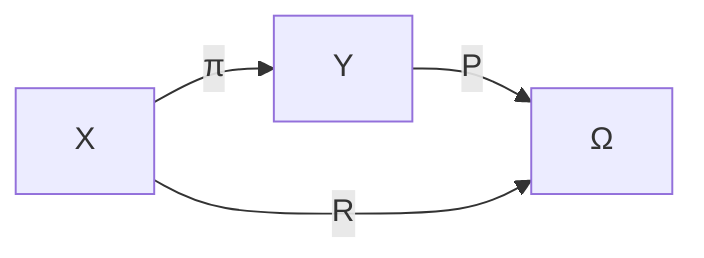

There are actually **two different notions of projection** here, and it's important not to conflate them.

1. **Orthogonal projection** (linear algebra)
2. **Projection / quotient / homomorphism** (universal algebra, category theory, set theory)

Your derived-variable discussion is fundamentally about **the second**, not the first.

---

# 1. Universal algebra

Suppose an algebra is

$$
\mathbf{A}=(A,F)
$$

where

* $A$ is the carrier set,
* $F$ is the family of operations.

A map

$$
\pi:A\to B
$$

is a **homomorphism** if every operation is preserved.

For every $n$-ary operation

$$
f:A^n\to A,
$$

we require

$$
\boxed{
\pi\!\bigl(f(a_1,\ldots,a_n)\bigr)
=
f_B\!\bigl(\pi(a_1),\ldots,\pi(a_n)\bigr).
}
$$

This is the algebraic notion of "projection preserving structure."

---

## Your example

Suppose

$$
f(A,S)=A|_S.
$$

If your downstream computation is

$$
\operatorname{sum},
$$

then you'd like

$$
\operatorname{sum}(A|_S)
$$

to depend only on

$$
A|_S,
$$

not on

$$
(A,S).
$$

You've formed a quotient of information.

---

# 2. Set-theoretic formulation

Suppose

$$
f:X\to Y.
$$

Then $f$ induces an equivalence relation

$$
x_1\sim x_2
\iff
f(x_1)=f(x_2).
$$

These are the **fibres**.

Example

$$
(A,S_1)\sim(A,S_2)
$$

if

$$
A|_{S_1}=A|_{S_2}.
$$

The quotient set is

$$
X/{\sim}.
$$

Your projection is exactly

$$
\pi:X\to X/{\sim}.
$$

---

# 3. The property you discovered

A predicate

$$
R:X\to\Omega
$$

can be pushed through

$$
\pi
$$

iff

$$
R
$$

is constant on every equivalence class.

Formally,

$$
\boxed{
x_1\sim x_2
\Longrightarrow
R(x_1)=R(x_2).
}
$$

This is the essential property.

---

# 4. Category theory

You have

$$
X
\xrightarrow{\pi}
Y
\xrightarrow{P}
\Omega.
$$

The question is

> Does there exist

$$
P
$$

such that

$$
R=P\circ\pi?
$$

Diagram

If it commutes,

then

$$
R
$$

**factors through**

$$
\pi.
$$

This is called a **factorization**.

---

# 5. Why sums work

Suppose

$$
\pi(A,S)=A|_S.
$$

Take

$$
R(A,S) := \bigl(\operatorname{sum}(A|_S)=k\bigr).
$$

If

$$
\pi(A,S_1)=\pi(A,S_2),
$$

then

$$
A|_{S_1}=A|_{S_2},
$$

so automatically

$$
\operatorname{sum}(A|_{S_1})=\operatorname{sum}(A|_{S_2}).
$$

Hence

$$
R
$$

is constant on fibres.

Therefore it factors.

---

# 6. Why left endpoint fails

Suppose

$$
R(A,S) := (l\text{ is even}).
$$

Two different intervals may produce identical sequences.

Then

$$
(A,S_1)\sim(A,S_2)
$$

but

$$
R(A,S_1)\neq R(A,S_2).
$$

Therefore

$$
R
$$

does **not** descend to the quotient.

---

# 7. The universal algebra interpretation

Universal algebra phrases this slightly differently.

A homomorphism

$$
\pi:\mathbf{A}\to\mathbf{B}
$$

identifies elements.

The identified elements form a **congruence**

$$
\theta
\subseteq
A\times A.
$$

A predicate can be pushed through iff it is **congruence invariant**.

Meaning

$$
a\equiv_\theta b
\Longrightarrow
P(a)=P(b).
$$

Notice how similar this is to the fibre condition.

---

# 8. This is the general principle

Everything you've been exploring reduces to one statement:

$$
\boxed{
\text{A derived variable is valid exactly when every downstream computation is invariant under the information discarded by the projection.}
}
$$

Set theory says:

* invariance on equivalence classes.

Universal algebra says:

* invariance under a congruence.

Category theory says:

* factorization through a morphism.

Compiler theory says:

* the intermediate representation is a sufficient abstraction.

Statistics says:

* the derived variable is a sufficient statistic.

These are all manifestations of the same underlying idea: once you identify (or quotient) states, every later computation must give the same result on each identified class, or else the projection has thrown away information that computation still needs.
