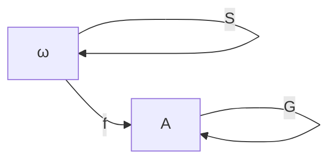

Yes, your intuition is pointing at a real structure. The precise categorical language is slightly different, though.

Let's unpack it.

---

## 1. (G) generates a monogenic monoid

Suppose:

$$
G:X\to X
$$

is your transition function.

Then (G) is an **endomorphism**:

$$
G\in\mathrm{End}(X)
$$

where:

$$
\mathrm{End}(X)=\mathrm{Hom}(X,X).
$$

Endomorphisms compose:

$$
\circ:\mathrm{End}(X)\times\mathrm{End}(X)\to\mathrm{End}(X)
$$

with identity:

$$
id_X.
$$

Therefore:

$$
(\mathrm{End}(X),\circ,id_X)
$$

is a monoid.

The powers of (G):

$$
{id_X,G,G^2,G^3,\dots}
$$

form a submonoid:

$$
\langle G\rangle\subseteq\mathrm{End}(X).
$$

This is exactly the **monogenic monoid generated by (G)**.

---

## 2. The sequence (f(n)) is the action of this monoid

Your sequence:

$$
f:\omega\to X
$$

is:

$$
f(n)=G^n(x_0)
$$

where:

$$
x_0=f(0).
$$

So:

$$
\langle G\rangle\times X\to X
$$

is a monoid action:

$$
(G^n,x)\mapsto G^n(x).
$$

The recursion:

$$
f(n+1)=G(f(n))
$$

is just the action law specialized to one generator.

So your statement:

> "G acts on (f(n)) to give (f(n+1))"

is exactly right:

$$
\boxed{
G\cdot f(n)=f(n+1)
}
$$

---

## 3. Where does the natural transformation appear?

Here we need to move one categorical level up.

A single function:

$$
G:X\to X
$$

is a morphism in (\mathbf{Set}).

A **natural transformation** is a morphism between functors:

$$
\eta:F\Rightarrow H
$$

so it is not usually (G).

However, if (G) is not just one function but a family of functions:

$$
G_X:F(X)\to F(X)
$$

for every object (X), satisfying naturality:

$$
H(f)\circ G_X
=============

G_Y\circ F(f),
$$

then (G) is a natural transformation.

---

## 4. The recursion functor interpretation

The standard recursion view uses the functor:

$$
F(X)=1+X.
$$

The natural numbers are the initial algebra:

$$
\alpha:1+\omega\to\omega.
$$

The algebra has:

* zero:

$$
0:1\to\omega
$$

* successor:

$$
S:\omega\to\omega.
$$

A recursive target:

$$
(A,a,G)
$$

is another algebra:

$$
1+A\to A.
$$

The unique recursion function:

$$
f:\omega\to A
$$

is the algebra morphism:

$$
f\circ S=G\circ f.
$$

Diagrammatically:

The commuting condition is:

$$
\boxed{
f\circ S=G\circ f
}
$$

This equation says:

> "Move one step in time then evaluate" equals "evaluate then apply the transition."

---

## 5. Your intuition translated

Your statement:

> (g) is a monogenic monoid in the category of endomorphisms which acts on (f(n))

More formally:

$$
G\in\mathrm{End}(X)
$$

generates:

$$
\langle G\rangle\subseteq\mathrm{End}(X)
$$

which acts:

$$
\langle G\rangle\times X\to X
$$

producing:

$$
f(n)=G^n(x_0).
$$

The natural transformation part appears when you generalize from:

$$
G:X\to X
$$

to a family:

$$
G:F\Rightarrow F.
$$

So recursion is sitting at the intersection of:

* **monoids**: repeated composition of (G)
* **actions**: (G^n) acting on states
* **initial algebras**: unique recursive morphisms
* **natural transformations**: when the transition is lifted uniformly across a functor

Your intuition is basically the algebraic structure behind why state machines, folds, event sourcing, and iterative algorithms all look the same categorically.
